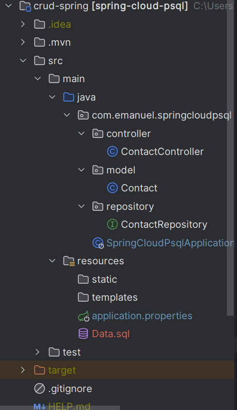
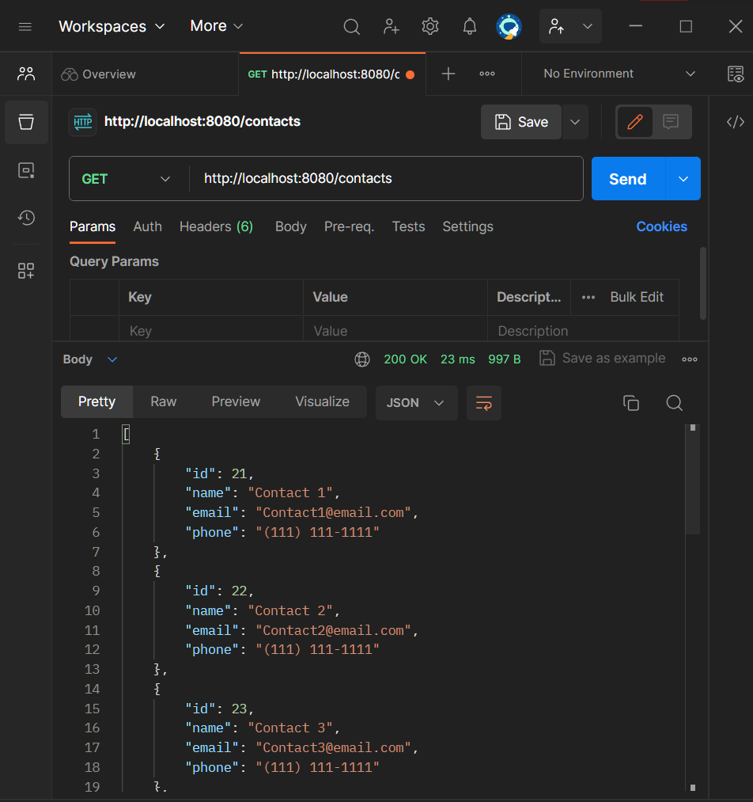
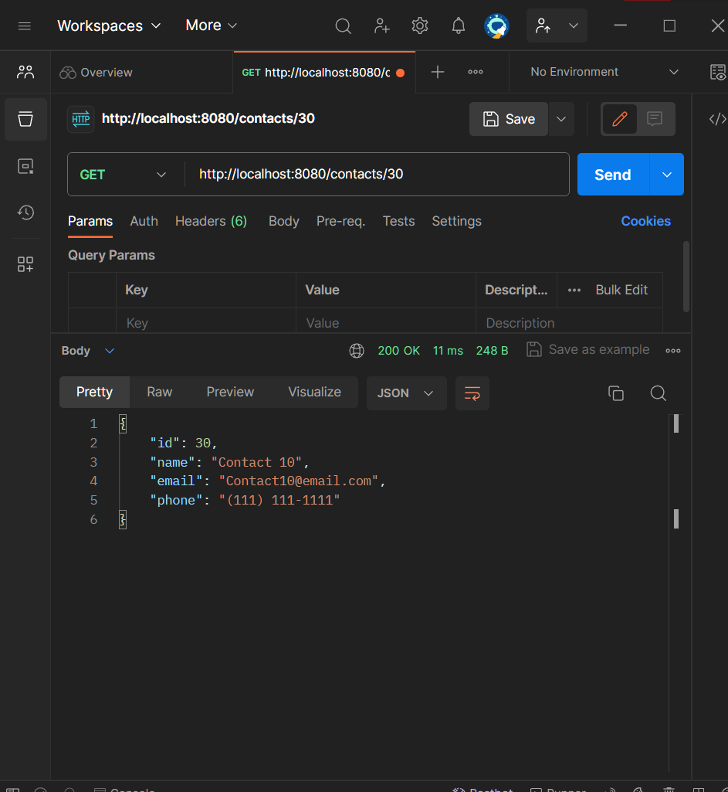

# crud-spring


> projeto spring criado com as dependencias: 

### spring web:

```ruby
    <dependency>
      <groupId>org.springframework.boot</groupId>
      <artifactId>spring-boot-starter-web</artifactId>
    </dependency>
```
Essa dependência é usada para criar aplicativos da web com Spring Boot. Ela inclui componentes para desenvolvimento web, como o Spring MVC (Model-View-Controller) para construir controladores, manipuladores de solicitações e views.


### PostgreSql and Mysql Drivers:


```ruby
  <dependency>
      <groupId>com.mysql</groupId>
      <artifactId>mysql-connector-j</artifactId>
      <scope>runtime</scope>
 </dependency>
 <dependency>
      <groupId>org.postgresql</groupId>
      <artifactId>postgresql</artifactId>
      <scope>runtime</scope>
 </dependency>
```
com.mysql:mysql-connector-j:

Esta dependência é usada para se conectar a um banco de dados MySQL. Ela fornece o driver JDBC (Java Database Connectivity) necessário para se comunicar com um banco de dados MySQL.

org.postgresql:postgresql:

Essa dependência é usada para se conectar a um banco de dados PostgreSQL. Ela fornece o driver JDBC para se comunicar com um banco de dados PostgreSQL.


### Spring Data Jpa:

```ruby
   <dependency>
      <groupId>org.springframework.boot</groupId>
      <artifactId>spring-boot-starter-data-jpa</artifactId>
    </dependency>
    
```
Esta dependência é usada em projetos Spring Boot que desejam usar o JPA (Java Persistence API) para acesso a bancos de dados. Ela inclui bibliotecas necessárias para trabalhar com JPA, como Hibernate, e configurações padrão.
O Hibernate é um framework de mapeamento objeto-relacional (ORM) em Java. Ele simplifica a interação entre um aplicativo Java e um banco de dados relacional, permitindo que os desenvolvedores trabalhem com objetos Java em vez de escrever SQL diretamente. O objetivo principal do Hibernate é mapear objetos Java para tabelas de banco de dados e vice-versa, facilitando o desenvolvimento de aplicativos que usam bancos de dados relacionais.


### Lombok :

```ruby
    <dependency>
      <groupId>org.projectlombok</groupId>
      <artifactId>lombok</artifactId>
      <optional>true</optional>
    </dependency>
```

O projeto Lombok é uma biblioteca que ajuda a reduzir a verbosidade do código Java, como mencionado anteriormente. No entanto, essa dependência é marcada como opcional (<optional>true</optional>), o que significa que seu uso é opcional e não é necessário para a funcionalidade principal do projeto. Ela é frequentemente usada para simplificar a criação de classes de entidades e reduzir a quantidade de código repetitivo.

### spring-boot-starter-test:

```ruby
    <dependency>
      <groupId>org.springframework.boot</groupId>
      <artifactId>spring-boot-starter-test</artifactId>
      <scope>test</scope>
    </dependency>
```

## Pom:


```ruby
<?xml version="1.0" encoding="UTF-8"?>
<project xmlns="http://maven.apache.org/POM/4.0.0" xmlns:xsi="http://www.w3.org/2001/XMLSchema-instance"
	xsi:schemaLocation="http://maven.apache.org/POM/4.0.0 https://maven.apache.org/xsd/maven-4.0.0.xsd">
	<modelVersion>4.0.0</modelVersion>
	<parent>
		<groupId>org.springframework.boot</groupId>
		<artifactId>spring-boot-starter-parent</artifactId>
		<version>3.1.5</version>
		<relativePath/> <!-- lookup parent from repository -->
	</parent>
	<groupId>com.emanuel</groupId>
	<artifactId>spring-cloud-psql</artifactId>
	<version>0.0.1-SNAPSHOT</version>
	<name>spring-cloud-psql</name>
	<description>project for Spring Boot</description>
	<properties>
		<java.version>21</java.version>
	</properties>
	<dependencies>
		<dependency>
			<groupId>org.springframework.boot</groupId>
			<artifactId>spring-boot-starter-data-jpa</artifactId>
		</dependency>
		<dependency>
			<groupId>org.springframework.boot</groupId>
			<artifactId>spring-boot-starter-web</artifactId>
		</dependency>

		<dependency>
			<groupId>com.mysql</groupId>
			<artifactId>mysql-connector-j</artifactId>
			<scope>runtime</scope>
		</dependency>
		<dependency>
			<groupId>org.postgresql</groupId>
			<artifactId>postgresql</artifactId>
			<scope>runtime</scope>
		</dependency>
		<dependency>
			<groupId>org.projectlombok</groupId>
			<artifactId>lombok</artifactId>
			<optional>true</optional>
		</dependency>
		<dependency>
			<groupId>org.springframework.boot</groupId>
			<artifactId>spring-boot-starter-test</artifactId>
			<scope>test</scope>
		</dependency>
	</dependencies>

	<build>
		<plugins>
			<plugin>
				<groupId>org.springframework.boot</groupId>
				<artifactId>spring-boot-maven-plugin</artifactId>
				<configuration>
					<excludes>
						<exclude>
							<groupId>org.projectlombok</groupId>
							<artifactId>lombok</artifactId>
						</exclude>
					</excludes>
				</configuration>
			</plugin>
		</plugins>
	</build>

</project>
```

>project O elemento raiz do arquivo POM, que contém todas as configurações do projeto.
>modelVersion Define a versão do modelo do POM. A versão "4.0.0" é a versão atual do modelo.

>parent Define o projeto pai (parent project), que é uma maneira de herdar configurações e dependências de um projeto pai. Neste caso, o projeto pai é spring-boot-starter-parent, que é usado frequentemente em projetos Spring Boot.

>groupId Define o identificador do grupo do projeto. Geralmente, é uma convenção de nomeação que ajuda a identificar o projeto e a organização responsável por ele.

>artifactId Define o identificador de artefato do projeto. Isso é geralmente o nome do projeto.

>version Define a versão do projeto.

>name O nome do projeto.

>description Uma breve descrição do projeto.

>properties Aqui, você pode definir propriedades que podem ser referenciadas em outros lugares do POM. Neste caso, a versão do Java usada é definida como "21".

>dependencies Define as dependências do projeto. As dependências são bibliotecas que o projeto usa. Neste caso, o projeto depende de várias bibliotecas Spring Boot, como spring-boot-starter-data-jpa, spring-boot-starter-web, e outras, além de bibliotecas relacionadas a banco de dados como o MySQL e o PostgreSQL.

>build Define a configuração de compilação do projeto.

>plugins Define plugins do Maven, que são usados para realizar tarefas específicas durante o ciclo de vida de construção do projeto.

>plugin Especifica um plugin, neste caso, o spring-boot-maven-plugin. Esse plugin é específico para projetos Spring Boot e é usado para criar artefatos executáveis do Spring Boot.

>configuration Contém as configurações específicas para o plugin. Aqui, o plugin é configurado para excluir a dependência do Lombok durante a construção do artefato, o que é útil para evitar problemas de dependência ao criar o JAR executável.


## Project Structure:



 ## Model:

### Contact.java

```ruby
@AllArgsConstructor
@NoArgsConstructor
@Data
@Entity
public class Contact {

  @Id
  @GeneratedValue(strategy = GenerationType.IDENTITY)
  private Long id;

  private String name;
  private String email;
  private String phone;
}
```
>AllArgsConstructor: automatically creates a class construtor with all arguments (properties).

>NoArgsConstructor: automatically creates an empty class construtor with all arguments (properties).

>Data: creates toString, equals, hashCode, getters and setters.

>anotação @Entity é usada para marcar a classe Contact como uma entidade JPA (Java Persistence API), o que significa que ela será mapeada para uma tabela em um banco de dados relacional.

>A anotação @GeneratedValue é usada para especificar como os valores da coluna de chave primária (no caso, id) são gerados automaticamente. No código, está configurado para usar a estratégia GenerationType.IDENTITY, que geralmente é usada com bancos de dados que suportam a geração de chaves primárias automaticamente, como o MySQL e o PostgreSQL.

>A enumeração GenerationType define diferentes estratégias para gerar valores de chave primária automaticamente.

>Esta anotação marca o campo id como a chave primária da entidade.

>@GeneratedValue(strategy = GenerationType.IDENTITY):

>Esta anotação configura a geração automática do valor da chave primária. No caso, a estratégia usada é GenerationType.IDENTITY, que delega a geração da chave primária ao banco de dados.

>A classe Contact possui quatro campos: id, name, email, e phone. Esses campos representam as informações de contato de uma entidade no banco de dados.


## Repository:

### ContactRepository.java (Interface):


```ruby
package com.emanuel.springcloudpsql.repository;

import com.emanuel.springcloudpsql.model.Contact;
import org.springframework.data.jpa.repository.JpaRepository;
import org.springframework.stereotype.Repository;

@Repository
public interface ContactRepository extends JpaRepository<Contact, Long> {
    
}

```
> Para ter acesso facil aos methodos que vão manipular a tabela de contatos, precisamos apenas criar uma interface que extenda JpaRepository passando a classe que representa nosso model e o tipo da chave primaria como, argumentos genericos;
> a interface ContactRepository é uma interface Spring Data JPA que fornece métodos predefinidos para realizar operações de persistência de dados no banco de dados relacionado à entidade Contact. Essa interface é anotada com @Repository, tornando-a um componente gerenciado pelo Spring e permitindo a injeção dela em outros componentes da aplicação que desejem realizar operações de banco de dados relacionadas a contatos;


## Controller:

###  ContactController.java 

```ruby
package com.emanuel.springcloudpsql.controller;

import com.emanuel.springcloudpsql.repository.ContactRepository;
import org.springframework.web.bind.annotation.RequestMapping;
import org.springframework.web.bind.annotation.RestController;

@RestController
@RequestMapping({"/contacts"})
public class ContactController {

    private ContactRepository repository;

    ContactController(ContactRepository contactRepository){
        this.repository = contactRepository;
    }

}

```

>A anotação @RestController contém as anotações @Controller e @ResponseBody. A anotação @Controller representa uma classe com endpoints, e a @ResponseBody indica que o valor de retorno de um método deve ser vinculado ao corpo da resposta da web (conforme a documentação)."

>Uma "classe com endpoints" se refere a uma classe em um aplicativo web que contém métodos que tratam solicitações HTTP específicas. Cada método em tal classe é conhecido como um "endpoint" porque corresponde a um ponto de acesso ou URL no aplicativo que os clientes podem chamar para realizar uma ação específica. Em outras palavras, os endpoints são os pontos de entrada para interações com o aplicativo por meio da web.

>Esses endpoints são responsáveis por lidar com solicitações HTTP, como GET, POST, PUT e DELETE, e realizar operações relacionadas ao recurso representado pelo endpoint. Por exemplo, em um aplicativo de gerenciamento de contatos, uma classe com endpoints pode conter métodos que permitem:

- Obter a lista de todos os contatos (usando o método GET).
- Adicionar um novo contato (usando o método POST).
- Atualizar um contato existente (usando o método PUT).
- Excluir um contato (usando o método DELETE).

>The @RequestMapping("/contacts") indicates that the url of the API in this controller will start with /contacts, so we will be able to access http://localhost:8080/contacts as our endpoint.


#### Retrieve All Contacts (GET /contacts)
 ```ruby
 @GetMapping
public List findAll(){
  return repository.findAll();
}
 ```
> The findAll method is going to retrieve all the records from the database ```
> (select * from contact).```
> @GetMapping é uma anotação que especifica que o método findAll deve ser invocado quando houver uma solicitação HTTP do tipo GET no endpoint mapeado por padrão. Isso significa que o método findAll será executado quando um cliente fizer uma solicitação GET para o endpoint raiz do controlador, que geralmente é algo como "/contacts".
O método findAll é responsável por recuperar todos os contatos do repositório (banco de dados) e retorná-los como uma lista. Normalmente, isso resulta em uma resposta com uma lista de contatos em formato JSON.
#### Retrieve a Contact by ID (GET /contacts/{id})

```ruby
@GetMapping(path = {"/{id}"})
public ResponseEntity<Contact> findById(@PathVariable long id){
  return repository.findById(id)
          .map(record -> ResponseEntity.ok().body(record))
          .orElse(ResponseEntity.notFound().build());
}
```

>The @PathVariable annotation binds the method parameter id with the path variable \{id}.
we will go to the database and will try to retrieve the contact ```
 (select * from contact where id = ?).```
If a contact is found, we return it (HTTP 200 - OK), else, we return HTTP 404 -Not Found.
>Nesse caso, @GetMapping é usado novamente para mapear solicitações GET, mas com um caminho específico, que inclui um parâmetro {id} entre chaves. Isso permite que o método findById seja acionado quando uma solicitação GET é feita para um URL que inclui um valor de identificação, por exemplo, "/contacts/123", onde "123" é o valor do identificador.
O método findById recebe o valor do identificador como um parâmetro de caminho usando a anotação @PathVariable. Ele busca um contato com o identificador fornecido no repositório. Se encontrar o contato, retorna um objeto ResponseEntity com um código de status 200 (OK) e o corpo da resposta contendo o contato. Caso contrário, retorna um ResponseEntity com um código de status 404 (Not Found).

#### Create a new Contact (POST /contacts)

```ruby
@PostMapping
public Contact create(@RequestBody Contact contact){
    return repository.save(contact);
}
```

>The @RequestBody annotation indicates a method parameter should be bound to the body of the web request. This means the method expects the following content from que request (in JSON format):

```ruby
{
    "name": "Java",
    "email": "java@email.com",
    "phone": "(111) 111-1111"
}
```
>Spring will automatically parse the request and create a variable of type Contact with its contents. Then, it will save it. The id of the contact will be null, therefore the save method will perform an insert into the Contact table.
> @PostMapping e public Contact create(@RequestBody Contact contact):
@PostMapping é uma anotação que mapeia solicitações HTTP do tipo POST para o método create. Isso significa que o método create será chamado quando uma solicitação POST for feita para o endpoint correspondente.
O método create recebe um objeto Contact no corpo da solicitação, que é deserializado automaticamente a partir do JSON enviado no corpo da solicitação. O método insere o novo contato no repositório (banco de dados) usando o método save e, em seguida, retorna o contato criado.

#### Update a Contact (PUT /contacts)

```ruby
@PutMapping(value="/{id}")
  public ResponseEntity<Contact> update(@PathVariable("id") long id,
                                        @RequestBody Contact contact){
    return repository.findById(id)
        .map(record -> {
            record.setName(contact.getName());
            record.setEmail(contact.getEmail());
            record.setPhone(contact.getPhone());
            Contact updated = repository.save(record);
            return ResponseEntity.ok().body(updated);
        }).orElse(ResponseEntity.notFound().build());
  }
  ```
>In order to update a contact, we need to inform its ID in the path variable. We also need to pass the updated contact.

>Next, we will try to find the contact to be updated. If the contact is found, we update the values from the record from the database with the values passed as parameter to the method and save it. In this case, as the record exists, an update statement will performed in the contact table. We also return the updated contact. In case the contact is not found, it returns HTTP 404.

>@DeleteMapping é uma anotação que mapeia solicitações HTTP do tipo DELETE para o método delete. Isso significa que o método delete será executado quando uma solicitação DELETE for feita para o endpoint correspondente, que inclui um parâmetro de caminho {id}.
O método delete recebe o valor do identificador (id) como um parâmetro de caminho usando a anotação @PathVariable. Ele verifica se existe um contato com o identificador fornecido no repositório. Se o contato existir, ele é excluído usando repository.deleteById(id) e uma resposta com código de status 200 (OK) é retornada. Se o contato não existir, uma resposta com código de status 404 (Not Found) é retornada.

#### Remove a Contact (DELETE /contacts/{id})

```ruby
@DeleteMapping(path ={"/{id}"})
  public ResponseEntity<?> delete(@PathVariable("id") long id) {
    return repository.findById(id)
        .map(record -> {
            repository.deleteById(id);
            return ResponseEntity.ok().build();
        }).orElse(ResponseEntity.notFound().build());
  }
```
> To remove a contact, we first need to retrieve it from the database. In case it is found, we delete it passing its ID and return HTTP 200 to indicate the deletion was performed successfully. In case the contact is not found, we return HTTP 404.

>@PutMapping é uma anotação que mapeia solicitações HTTP do tipo PUT para o método update. Isso significa que o método update será executado quando uma solicitação PUT for feita para o endpoint correspondente, que inclui um parâmetro de caminho {id}.
O método update recebe o valor do identificador (id) como um parâmetro de caminho usando a anotação @PathVariable e um objeto Contact no corpo da solicitação usando a anotação @RequestBody.
O método verifica se existe um contato com o identificador fornecido no repositório. Se o contato existir, ele atualiza os campos do contato com os valores fornecidos no objeto contact e salva as alterações usando repository.save(record). Em seguida, ele retorna uma resposta com código de status 200 (OK) contendo o contato atualizado. Se o contato não existir, uma resposta com código de status 404 (Not Found) é retornada.


## Bean:

```ruby
@SpringBootApplication
public class SpringCloudMysqlApplication {

	public static void main(String[] args) {
		SpringApplication.run(SpringCloudMysqlApplication.class, args);
	}

	@Bean
	CommandLineRunner init(ContactRepository repository) {
		return args -> {
			repository.deleteAll();
			LongStream.range(1, 11)
					.mapToObj(i -> {
						Contact c = new Contact();
						c.setName("Contact " + i);
						c.setEmail("contact" + i + "@email.com");
						c.setPhone("(111) 111-1111");
						return c;
					})
					.map(v -> repository.save(v))
					.forEach(System.out::println);
		};
	}
}
```
> - this step is optional in case you already using an existing database/table.

>@SpringBootApplication:
Essa anotação é usada para marcar a classe SpringCloudMysqlApplication como a classe principal do aplicativo Spring Boot. Isso significa que a partir dessa classe, o aplicativo será inicializado.
public static void main(String[] args):
Esse é o método principal do aplicativo, que inicia o aplicativo Spring Boot quando é executado. Ele chama SpringApplication.run() para iniciar o aplicativo.
@Bean CommandLineRunner init(ContactRepository repository):

>Essa anotação @Bean marca o método init como um método que cria e configura um bean Spring. Especificamente, o método init retorna um CommandLineRunner, que é uma interface Spring Boot usada para executar código ao iniciar o aplicativo.
O método init recebe um parâmetro do tipo ContactRepository, que é usado para interagir com o repositório de contatos (banco de dados).
Código dentro do CommandLineRunner:

>Dentro do CommandLineRunner, o código é executado quando o aplicativo é iniciado. Esse código realiza as seguintes ações:
- repository.deleteAll(): Remove todos os registros existentes na tabela de contatos, se houver algum.

- wLongStream.range(1, 11): Isso cria um fluxo de números inteiros de 1 a 10 (inclusive).

- mapToObj(i -> { ... }): Mapeia cada número do fluxo para um objeto Contact com valores de nome, e-mail e telefone específicos.

- map(v -> repository.save(v)): Salva cada objeto Contact no banco de dados usando o repositório ContactRepository.

- forEach(System.out::println): Imprime os objetos Contact salvos no banco de dados.

>Esse trecho de código é usado para inicializar o banco de dados com alguns registros de contato quando o aplicativo é iniciado. Ele remove registros existentes (caso haja) e insere novos registros na tabela de contatos. Essa etapa é opcional e pode ser útil para preencher o banco de dados com dados iniciais para testes e desenvolvimento.


## DataBase:

```ruby
## Spring DATASOURCE (DataSourceAutoConfiguration & DataSourceProperties)
spring.datasource.url=jdbc:postgresql://localhost:5432/CrudSpringBoot?useSSL=false
#your database name and password

spring.datasource.username=postgres
spring.datasource.password=root

spring.datasource.driver-class-name=org.postgresql.Driver
spring.jpa.database-platform=org.hibernate.dialect.PostgreSQLDialect
spring.jpa.hibernate.ddl-auto=update
```

```ruby
CREATE TABLE `mydatabase`.`contact` (
  `id` INT NOT NULL,
  `name` VARCHAR(255) NULL,
  `email` VARCHAR(255) NULL,
  `phone` VARCHAR(45) NULL,
  PRIMARY KEY (`id`));

  ALTER TABLE `mydatabase`.`contact`
  CHANGE COLUMN `id` `id` INT(11) NOT NULL AUTO_INCREMENT ,
  ADD UNIQUE INDEX `id_UNIQUE` (`id` ASC);
```


## Postman:


